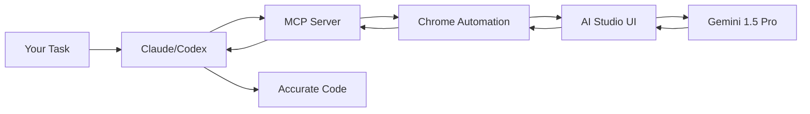

<div align="center">

# AI Studio MCP Server

**Let your CLI agents (Claude, Cursor, Codex...) chat directly with Google AI Studio to leverage Gemini 1.5 Pro without API costs!**

[](https://www.typescriptlang.org/)
[](https://modelcontextprotocol.io/)

</div>

---

## The Problem

Using powerful models like Gemini 1.5 Pro inside coding agents usually means burning through expensive API credits quickly.

## The Solution

Let your local agents chat directly with **Google AI Studio** through your browser! You can utilize the generous free tier or your existing Google AI Pro subscription through the web interface, **bypassing the API billing completely.**

```
Your Task → Local Agent asks AI Studio via Browser → Gemini processes it → Agent writes code
```

**The real advantage**: The MCP server automates a headless (or visible) Chrome browser to interact with the aistudio.google.com UI. It can start new chats, send prompts, set system instructions, upload files, and stream the responses back to your local IDE or CLI!

---

## Core Features

### **No API Keys Needed**
It uses an automated browser session logged into your Google account. Zero API costs.

### **Persistent Sessions**
Claude can continue a previous conversation thread by using its Chat ID. No need to resend the entire context window!

### **Prompt Presets**
Create and save predefined "Presets" (System Instructions, Preferred Model) to instantly switch between different assistant personas.

### **Cross-Tool Sharing**
Set up once, use everywhere. Claude Code, Codex, Cursor — all share the same chat library.

---

## Installation

### Cursor

Add to `~/.cursor/mcp.json`:
```json
{
  "mcpServers": {
    "aistudio": {
      "command": "npx",
      "args": ["-y", "aistudio-mcp@latest"]
    }
  }
}
```

### Claude Code
```bash
claude mcp add aistudio npx aistudio-mcp@latest
```

---

## Quick Start

### 1. Install the MCP server

### 2. Authenticate (one-time)

Say in your chat (Claude/Codex):
```
"Open AI Studio auth setup"
```
*A Chrome window opens → log in with your Google account*

### 3. Start Chatting
```
"Create a new chat in AI Studio and ask it to write a Python script for me."
```

---

## Available Tools

| Tool | Use Case |
|---------|----------|
| **send_prompt** | Send a prompt to AI Studio (can continue an existing chat or create a new one). Supports setting models, system instructions, and file uploads. |
| **create_chat** | Start a fresh chat session explicitly. |
| **list_chats** | List all local tracked AI Studio chat sessions. |
| **select_chat** | Choose a specific chat as your active session. |
| **remove_chat** | Untrack a chat session locally. |
| **add_preset** | Save a prompt preset (System instructions, Model type). |
| **list_presets** | List all your saved presets. |
| **remove_preset** | Delete a prompt preset. |
| **setup_auth** | Opens the browser to authenticate with Google. |

---

## Architecture



---

## Common Commands

| Intent | Say | Result |
|--------|-----|--------|
| Authenticate | *"Open AI Studio auth setup"* | Chrome opens for login |
| Ask a question | *"Ask AI Studio how to configure Nginx"* | Sends prompt, returns result |
| Continue chat | *"Follow up in the previous chat: what about Apache?"* | Resumes the previous chat |
| Use preset | *"Use the 'Coding Assistant' preset for this prompt"* | Sets system instructions/model |

---

## Disclaimer

This tool automates browser interactions with AI Studio to make your workflow more efficient.

**About browser automation:**
While it includes humanization features (realistic typing speeds, natural delays), Google may flag automated usage. We recommend using a dedicated Google account for automation rather than your primary account.

**License:**
MIT — Use freely in your projects.
